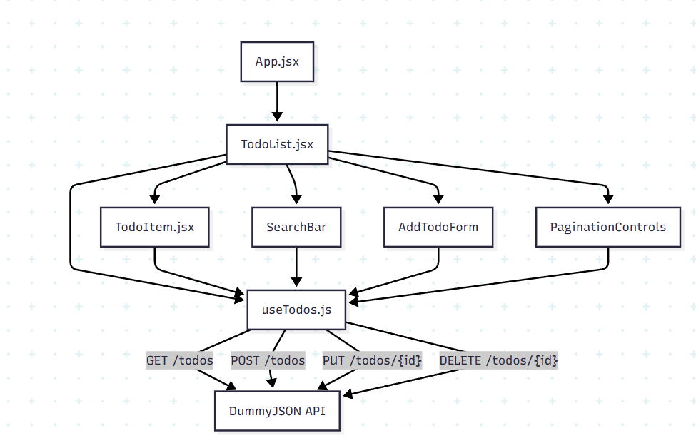

## Опис компонентів

**App.jsx**  
- Головний компонент додатку.  
- Підключає глобальні стилі `main.css`.  
- Рендерить `TodoList`.

**TodoList.jsx**  
- Контейнер для списку задач.  
- Використовує кастомний хук `useTodos` для:  
  - отримання даних з API,  
  - додавання/видалення/редагування задач,  
  - пошук і пагінація.  
- Рендерить дочірні компоненти:
  - `SearchBar` — поле пошуку
  - `AddTodoForm` — форма додавання задач
  - `PaginationControls` — керування сторінками
  - `TodoItem` — окремий елемент списку

**useTodos.js**  
- Кастомний хук для бізнес-логіки:  
  - стан задач,  
  - обробка подій (додавання, редагування, видалення),  
  - пошук і пагінація

**main.css**  
- Глобальні стилі для всіх компонентів.  
- Кольори, відступи, анімації та зовнішній вигляд елементів.
